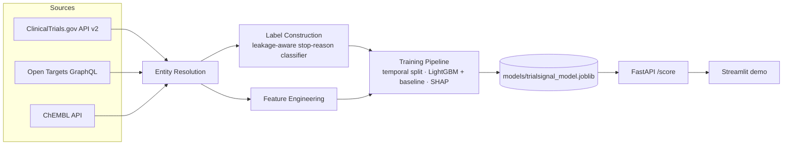

# TrialSignal

**Clinical trial outcome risk modeling and drug/target repurposing signal engine, built entirely on public pharma data.**

> Given a drug/target/disease hypothesis, estimate the probability a clinical
> trial testing it progresses successfully, and surface *why* — with SHAP
> explanations, not just a number.

[](https://github.com/julieneynard/trialsignal/actions/workflows/ci.yml)


> **Disclaimer:** research/portfolio project built entirely on public data.
> Not a validated clinical, investment, or regulatory decision tool. See
> [`docs/LIMITATIONS.md`](docs/LIMITATIONS.md).

## Why this exists

Pharma R&D costs run ~$2B per approved drug, and the single biggest lever on
that cost is killing bad bets earlier. This project builds the kind of signal
a translational-informatics or R&D-strategy team would use to do that: a
model that scores trial-progression risk from public target biology
([Open Targets](https://platform.opentargets.org/)), chemistry/mechanism
([ChEMBL](https://www.ebi.ac.uk/chembl/)), and trial outcome history
([ClinicalTrials.gov](https://clinicaltrials.gov/)) — joined through an
explicit, scored entity-resolution layer rather than a naive string match.

## Architecture



## What's actually implemented vs. planned

This is a portfolio project built in the open — the README reflects real
status, not the finished-product aspiration.

| Component | Status |
|---|---|
| ClinicalTrials.gov client (pagination, retry, typed parsing) | ✅ Implemented, tested |
| Leakage-aware label construction (stop-reason classifier) | ✅ Implemented, tested |
| Entity resolution (condition/gene normalization + scored EFO matching) | ✅ Implemented, tested |
| Open Targets / ChEMBL clients | 🚧 In progress |
| Feature engineering / join pipeline | 🚧 In progress |
| Model training (temporal split, LightGBM, SHAP) | ⬜ Planned |
| FastAPI `/score` endpoint (live scoring) | ⬜ Planned — API scaffold + tests exist, returns 501 until the feature pipeline lands |
| Streamlit demo | ⬜ Planned — UI exists, waiting on a live `/score` |

## Quickstart

```bash
uv pip install -e ".[dev]"

# lint, type-check, test — same checks CI runs
ruff check src tests
mypy src
pytest

# pull ClinicalTrials.gov data for a condition
trialsignal fetch-trials "non-small cell lung cancer" --output data/raw/nsclc.jsonl

# run the API (once a model has been trained)
trialsignal serve

# run the demo (in another terminal, API must be running)
streamlit run demo/app.py
```

Or via Docker:

```bash
docker build -t trialsignal-api .
docker run -p 8000:8000 -v $(pwd)/models:/app/models trialsignal-api
```

## Repo layout

```
src/trialsignal/
  data/        # source clients + schemas + entity resolution
  features/    # label construction + feature engineering
  models/      # training, evaluation, SHAP, model registry
  serving/     # FastAPI app
  cli.py       # `trialsignal` command
demo/          # Streamlit frontend
tests/unit/    # fixture-based tests, no live network calls
docs/          # METHODS.md, MODEL_CARD.md, LIMITATIONS.md
```

## Docs

- [`docs/METHODS.md`](docs/METHODS.md) — problem framing, data sources, modeling approach
- [`docs/MODEL_CARD.md`](docs/MODEL_CARD.md) — model card (populated post-training)
- [`docs/LIMITATIONS.md`](docs/LIMITATIONS.md) — known limitations, stated up front

## License

MIT — see [`LICENSE`](LICENSE).
