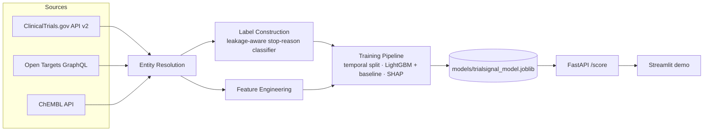

# TrialSignal

**Clinical trial outcome risk modeling and drug/target repurposing signal engine, built entirely on public pharma data.**

> Given a drug/target/disease hypothesis, estimate the probability a clinical
> trial testing it progresses successfully, and surface *why* — with SHAP
> explanations, not just a number.

[](https://github.com/julieneynard/trialsignal/actions/workflows/ci.yml)


> **Disclaimer:** research/portfolio project built entirely on public data.
> Not a validated clinical, investment, or regulatory decision tool. See
> [`docs/LIMITATIONS.md`](docs/LIMITATIONS.md).

## At a glance

- **What it does:** takes a drug/target/disease hypothesis (e.g. "osimertinib
  / EGFR / NSCLC") and returns a trial-progression risk score with a SHAP
  explanation, live, via a FastAPI endpoint — not a static notebook result.
- **Data:** 3 real public APIs — ClinicalTrials.gov, Open Targets, ChEMBL —
  joined through a hand-verified, scored entity-resolution layer. No
  synthetic or toy data anywhere in the pipeline.
- **Result, reported honestly:** ROC-AUC ≈ 0.68 (LightGBM, temporal
  holdout) — a real, modestly-above-chance signal, explicitly *not*
  decision-grade. Six trained versions are documented end-to-end, including
  the ones that got worse and a data-quality fix that moved feature
  importances without moving the metric — see "On the trained model" below.
- **Engineering:** typed Python end-to-end (`mypy --strict`), 124 tests
  (fixture-mocked *and* verified against live upstream data), CI (lint,
  types, tests, Docker build) green on every push, a Dockerized FastAPI
  service, and a Streamlit demo client.
- **30 seconds → skim "Skills demonstrated" just below. 5 minutes → "Why
  this exists" and the architecture diagram. Full technical depth →
  [`docs/METHODS.md`](docs/METHODS.md),
  [`docs/MODEL_CARD.md`](docs/MODEL_CARD.md),
  [`docs/LIMITATIONS.md`](docs/LIMITATIONS.md).**

## Skills demonstrated

| Skill | Where in this repo |
|---|---|
| API integration & resilient data engineering | 3 typed clients with retry/backoff and pagination — [`clinicaltrials.py`](src/trialsignal/data/clinicaltrials.py), [`open_targets.py`](src/trialsignal/data/open_targets.py), [`chembl.py`](src/trialsignal/data/chembl.py) |
| Entity resolution across heterogeneous ID systems | Scored disease matching + 4 documented naming-mismatch fixes, each found by testing against the live API before hardcoding — [`entity_resolution.py`](src/trialsignal/data/entity_resolution.py) |
| ML pipeline design & leakage prevention | Temporal train/test split (not casual k-fold), stop-reason classifier, results-based label correction — [`labels.py`](src/trialsignal/features/labels.py), [`label_validation.py`](src/trialsignal/features/label_validation.py) |
| Rigorous model evaluation | Every result cross-checked CV vs. temporal split before being trusted; 6 versions of re-measurement, including honest regressions — [`docs/MODEL_CARD.md`](docs/MODEL_CARD.md) |
| Interpretable ML | SHAP integration, per-prediction feature attributions exposed through the live API — [`models/train.py`](src/trialsignal/models/train.py) |
| Production API design | Async FastAPI, in-process caching, graceful degradation (503 with no model, clean 502 on upstream failure), Dockerized — [`serving/api.py`](src/trialsignal/serving/api.py) |
| Software engineering discipline | `mypy --strict`, `ruff`, 124 tests (`respx`-mocked + live-verified), typed schemas (`pydantic`), CI on every push — [`.github/workflows/ci.yml`](.github/workflows/ci.yml) |
| Honest technical communication | Limitations, rejected approaches, and negative results documented as thoroughly as what worked — [`docs/LIMITATIONS.md`](docs/LIMITATIONS.md) |

## Why this exists

Pharma R&D costs run ~$2B per approved drug, and the single biggest lever on
that cost is killing bad bets earlier. This project builds the kind of signal
a translational-informatics or R&D-strategy team would use to do that: a
model that scores trial-progression risk from public target biology
([Open Targets](https://platform.opentargets.org/)), chemistry/mechanism
([ChEMBL](https://www.ebi.ac.uk/chembl/)), and trial outcome history
([ClinicalTrials.gov](https://clinicaltrials.gov/)) — joined through an
explicit, scored entity-resolution layer rather than a naive string match.

## Architecture



## What's actually implemented

This is a portfolio project built in the open — the README reflects real
status, not the finished-product aspiration. v1's full pipeline (fetch →
entity-resolve → label → join → train → serve) is implemented, tested, and
verified against live data end-to-end; see "Roadmap" below for what's
genuinely next, not yet built.

| Component | Status |
|---|---|
| ClinicalTrials.gov client (pagination, retry, typed parsing) | ✅ Implemented, tested |
| Open Targets client (GraphQL, target-disease evidence + tractability + safety) | ✅ Implemented, tested |
| ChEMBL client (bioactivity, pagination) | ✅ Implemented, tested |
| Leakage-aware label construction (stop-reason classifier) | ✅ Implemented, tested |
| Entity resolution (condition/gene normalization + scored disease matching) | ✅ Implemented, tested |
| Feature engineering / join pipeline (`trialsignal build-features`) | ✅ Implemented, tested |
| Model training (temporal + CV split, LightGBM, SHAP) | ✅ Implemented, tested, trained on real data — **read the caveat below** |
| FastAPI `/score` endpoint (live scoring) | ✅ Implemented, tested, verified against live Open Targets + ChEMBL for all 17 curated hypotheses |
| Streamlit demo | ✅ Implemented — thin client over `/score`, renders risk score + SHAP + warnings |
| Results-based label validation & correction (`trialsignal validate-labels`, `labels.resolve_trial_label`) | ✅ Implemented, tested, run on real data — found a real label-quality problem, then fixed it (see below) |

All three source clients are verified against their live APIs, not just
fixtures — see the module docstrings in `clinicaltrials.py`, `open_targets.py`,
and `chembl.py` for the specific real-world surprises each API had (string-typed
numeric fields, mixed EFO/MONDO disease IDs, GraphQL errors that shouldn't be
retried) that a docs-only implementation would have missed.

**`/score` is verified against the live APIs, not just mocks.** Hand-testing
it end-to-end found and fixed two real issues before calling it done: (1) a
second instance of the CT.gov-vs-Open-Targets naming-mismatch pattern
("chronic myeloid leukemia" vs. Open Targets' "chronic myelogenous
leukemia, BCR-ABL1 positive") that silently broke the entire ABL1 hypothesis
until fixed in `entity_resolution.py`, and (2) a real latency/error-handling
gap — an unthrottled disease lookup took ~79s and once hit an unhandled 500
on a transient upstream 5xx, fixed by capping pagination depth and adding a
clean 502 for genuine upstream failures (see `serving/api.py`'s module
docstring and `docs/LIMITATIONS.md` item 8).

**On the trained model — read this before looking at the AUC.** Six
versions, each shipped only after being measured against real data:

- **v1** (2 hypotheses): ROC-AUC ≈ 0.92 — confounded. With only EGFR and
  ABL1, the model could win just by learning "which of the 2 drugs is
  this" (`ot_tractable_antibody` was literally 0/1 collinear with
  hypothesis identity). Not a working model.
- **v2** (7 hypotheses, mechanistic diversity): confound fixed, temporal
  ROC-AUC ≈ 0.5 — chance level. Honest, but revealed a second problem
  underneath the first: the registry-status label itself.
- **v3** (same 7 hypotheses, `resolve_trial_label` substituting each
  trial's real primary-endpoint result for the registry-status proxy
  wherever CT.gov posted one): 464 rows, 54 failures. Temporal ROC-AUC:
  ≈0.68 on a 48-row test set.
- **v4** (12 hypotheses, 3 new disease areas): 686 rows, 73 failures.
  Temporal ROC-AUC: ≈0.63 — *down* from v3, reported that way rather than
  keeping only the better-looking number; the CV-vs-temporal gap stayed
  just as tight (≈0.028 vs v3's ≈0.031), meaning v3's 0.68 was an
  optimistic read from a small 48-row test set.
- **v5** (17 hypotheses, 3 more disease areas + 2 more contrast pairs):
  **840 rows, 97 failures**. Temporal ROC-AUC: **≈0.68** — back up. The
  CV-temporal gap (≈0.035) stayed the same small size as v3/v4 but flipped
  direction (temporal now scores above CV, not below) — read that as
  ordinary sampling noise at n≈800–900, not a returning leakage problem
  (v2's actual confound produced a ≈0.2 gap in one fixed direction, a
  categorically different signal).
- **v6** (same 17 hypotheses, ChEMBL bioactivity matched molecule-name-first
  instead of a target-level fallback — verified live: 485 real
  osimertinib/EGFR bioactivity records existed but 0 were found by the old
  target-level pull): **843 rows, 102 failures**. Temporal ROC-AUC:
  **≈0.68 (0.676)** — essentially flat vs. v5, while `chembl_activity_count`
  moved up to the model's 3rd-most-important SHAP feature (from 4th). The
  fix moved `chembl_matched_by_molecule_name` from ~0% to exactly **100%**
  for all 13 small-molecule hypotheses, and confirmed (also verified live)
  that the 4 antibody hypotheses genuinely have **0** ChEMBL bioactivity
  records under any target — a real property of the database, not a gap in
  this project's matching. One number did move enough to flag rather than
  wave off: the CV-temporal gap widened to **≈−0.076** (from v5's −0.035) —
  still far below v2's leaky ≈0.2 gap, but the widest since the confound
  was fixed, and reported as an open question rather than smoothed over.

**Still not decision-grade**, and the headline number has now moved
0.5 → 0.68 → 0.63 → 0.68 → 0.68 across five re-measurements — which is the
actual point of publishing every version instead of only the current one:
the honest summary is "reliably modestly above chance, ±0.05–0.08," not a
single precise figure. ~83% of the dataset is still registry-status-labeled,
not results-based (broadening that coverage was investigated and explicitly
rejected as infeasible without fabricating labels — see
`docs/LIMITATIONS.md` item 1a). Full numbers, the per-hypothesis
breakdown, and the complete v1→v2→v3→v4→v5→v6 reasoning:
[`docs/MODEL_CARD.md`](docs/MODEL_CARD.md) and
[`docs/METHODS.md`](docs/METHODS.md).

## Quickstart

```bash
uv pip install -e ".[dev]"

# lint, type-check, test — same checks CI runs
ruff check src tests
mypy src
pytest

# pull data from each source
trialsignal fetch-trials "non-small cell lung cancer" --output data/raw/nsclc.jsonl
trialsignal fetch-target ENSG00000146648 --output data/raw/egfr_diseases.jsonl   # EGFR
trialsignal fetch-activities CHEMBL203 --output data/raw/egfr_activities.jsonl   # EGFR bioactivity

# join everything into a training-ready feature table for a curated hypothesis
trialsignal list-hypotheses
trialsignal build-features "EGFR / osimertinib / NSCLC" \
  --trials-path data/raw/nsclc.jsonl \
  --target-diseases-path data/raw/egfr_diseases.jsonl \
  --activities-path data/raw/egfr_activities.jsonl

# train (temporal split is the correct default; falls back to --eval-mode cv
# when there isn't enough data per class per time period — see METHODS.md)
trialsignal train data/processed/egfr_nsclc_features.csv --eval-mode cv

# check how much the registry-status label can be trusted, on the trials
# that have a real, checkable result posted (see docs/LIMITATIONS.md item 1)
trialsignal validate-labels data/processed/egfr_nsclc_features.csv

# run the API
trialsignal serve

# score a curated hypothesis (in another terminal; first request per
# hypothesis fetches live Open Targets/ChEMBL data, a few seconds)
curl -X POST http://localhost:8000/score \
  -H "Content-Type: application/json" \
  -d '{"gene_symbol": "EGFR", "disease_name": "non-small cell lung carcinoma"}'

# or run the demo
streamlit run demo/app.py
```

Or via Docker:

```bash
docker build -t trialsignal-api .
docker run -p 8000:8000 -v $(pwd)/models:/app/models trialsignal-api
```

## Repo layout

```
src/trialsignal/
  data/        # source clients + schemas + entity resolution
  features/    # label construction + feature engineering
  models/      # training, evaluation, SHAP, model registry
  serving/     # FastAPI app
  cli.py       # `trialsignal` command
demo/          # Streamlit frontend
tests/unit/    # fixture-based tests, no live network calls
docs/          # METHODS.md, MODEL_CARD.md, LIMITATIONS.md
```

## Roadmap

What would actually move the evaluation numbers, roughly in priority order
(all cross-referenced from `docs/LIMITATIONS.md`):

1. ~~Expand `CURATED_HYPOTHESES` beyond 2.~~ **Done, three times, ongoing.**
   2 → 7 (fixed the hypothesis-identity confound; on its own did *not* fix
   predictive accuracy, temporal ROC-AUC stayed ≈0.5 until item 2 below) →
   12 (3 new disease areas) → 17 (3 more disease areas + 2 more
   same-disease/different-mechanism contrast pairs). Each expansion was
   re-measured, not assumed to help: 0.68 (7 hyp.) → 0.63 (12 hyp.) → 0.68
   (17 hyp.) — a real wobble of ±0.05, checked against CV each time and
   consistent with sampling noise at this scale, not a trend in either
   direction (`docs/MODEL_CARD.md`). Continuing to add hypotheses remains
   the validated lever; each addition needs its own naming-mismatch check
   against the live API (4 for 4 so far — carcinoma/cancer, CML
   myelogenous/myeloid, multiple/plasma-cell myeloma, bladder/urinary
   bladder) and its own re-measurement, not just a bigger number assumed
   to be better.
2. ~~Parse CT.gov's trial *results* section~~ **Done.** `resolve_trial_label`
   substitutes the real primary-endpoint result for the registry-status
   proxy wherever available (~14% of trials) and rescues trials the proxy
   alone excluded. ~~Broadening coverage to the ~50% of trials with
   `hasResults=True`~~ **investigated and rejected** — checked against 133
   real examples first (same discipline as every other design decision
   here) and found ~70% of that gap is safety-only endpoints or single-arm
   trials with no comparator to judge success against at all, not a
   labeling problem a heuristic can responsibly close (`docs/LIMITATIONS.md`
   item 1a).
3. ~~Molecule-name-first ChEMBL queries~~ **Done (v6).** Resolve the
   compound to a ChEMBL molecule ID first (synonym search, covers generic
   and brand names), then query the molecule-target pair's activities
   directly, instead of filtering a large target-level activity page.
   `chembl_matched_by_molecule_name=True` went from the exception to the
   normal case for small-molecule hypotheses: exactly **100%** for all 13
   of them, confirmed against the live API. The 4 antibody hypotheses
   stayed at 0% — verified this is real ChEMBL coverage (no bioactivity
   record exists for these drugs under any target), not a matching gap.
   Net effect on the model: temporal ROC-AUC essentially unchanged
   (0.680 → 0.676) while `chembl_activity_count` became a top-3 SHAP
   feature — and the CV-temporal gap widened to ≈−0.076 (from −0.035),
   flagged rather than glossed over (`docs/LIMITATIONS.md` item 3a).
4. **Per-hypothesis fetch locking** in the API, so two concurrent
   cache-miss requests for the same hypothesis don't both hit the live
   APIs independently (LIMITATIONS.md item 8).
5. Extend past oncology once the pipeline's assumptions (stop-reason
   vocabulary, disease-naming patterns) are re-validated for another
   therapeutic area.

## Docs

- [`docs/METHODS.md`](docs/METHODS.md) — problem framing, data sources, modeling approach
- [`docs/MODEL_CARD.md`](docs/MODEL_CARD.md) — model card (populated post-training)
- [`docs/LIMITATIONS.md`](docs/LIMITATIONS.md) — known limitations, stated up front

## License

MIT — see [`LICENSE`](LICENSE).
