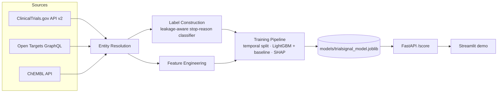

# TrialSignal

**Clinical trial outcome risk modeling and drug/target repurposing signal engine, built entirely on public pharma data.**

> Given a drug/target/disease hypothesis, estimate the probability a clinical
> trial testing it progresses successfully, and surface *why* — with SHAP
> explanations, not just a number.

[](https://github.com/julieneynard/trialsignal/actions/workflows/ci.yml)


> **Disclaimer:** research/portfolio project built entirely on public data.
> Not a validated clinical, investment, or regulatory decision tool. See
> [`docs/LIMITATIONS.md`](docs/LIMITATIONS.md).

## Why this exists

Pharma R&D costs run ~$2B per approved drug, and the single biggest lever on
that cost is killing bad bets earlier. This project builds the kind of signal
a translational-informatics or R&D-strategy team would use to do that: a
model that scores trial-progression risk from public target biology
([Open Targets](https://platform.opentargets.org/)), chemistry/mechanism
([ChEMBL](https://www.ebi.ac.uk/chembl/)), and trial outcome history
([ClinicalTrials.gov](https://clinicaltrials.gov/)) — joined through an
explicit, scored entity-resolution layer rather than a naive string match.

## Architecture



## What's actually implemented

This is a portfolio project built in the open — the README reflects real
status, not the finished-product aspiration. v1's full pipeline (fetch →
entity-resolve → label → join → train → serve) is implemented, tested, and
verified against live data end-to-end; see "Roadmap" below for what's
genuinely next, not yet built.

| Component | Status |
|---|---|
| ClinicalTrials.gov client (pagination, retry, typed parsing) | ✅ Implemented, tested |
| Open Targets client (GraphQL, target-disease evidence + tractability + safety) | ✅ Implemented, tested |
| ChEMBL client (bioactivity, pagination) | ✅ Implemented, tested |
| Leakage-aware label construction (stop-reason classifier) | ✅ Implemented, tested |
| Entity resolution (condition/gene normalization + scored disease matching) | ✅ Implemented, tested |
| Feature engineering / join pipeline (`trialsignal build-features`) | ✅ Implemented, tested |
| Model training (temporal + CV split, LightGBM, SHAP) | ✅ Implemented, tested, trained on real data — **read the caveat below** |
| FastAPI `/score` endpoint (live scoring) | ✅ Implemented, tested, verified against live Open Targets + ChEMBL for all 7 curated hypotheses |
| Streamlit demo | ✅ Implemented — thin client over `/score`, renders risk score + SHAP + warnings |
| Results-based label validation & correction (`trialsignal validate-labels`, `labels.resolve_trial_label`) | ✅ Implemented, tested, run on real data — found a real label-quality problem, then fixed it (see below) |

All three source clients are verified against their live APIs, not just
fixtures — see the module docstrings in `clinicaltrials.py`, `open_targets.py`,
and `chembl.py` for the specific real-world surprises each API had (string-typed
numeric fields, mixed EFO/MONDO disease IDs, GraphQL errors that shouldn't be
retried) that a docs-only implementation would have missed.

**`/score` is verified against the live APIs, not just mocks.** Hand-testing
it end-to-end found and fixed two real issues before calling it done: (1) a
second instance of the CT.gov-vs-Open-Targets naming-mismatch pattern
("chronic myeloid leukemia" vs. Open Targets' "chronic myelogenous
leukemia, BCR-ABL1 positive") that silently broke the entire ABL1 hypothesis
until fixed in `entity_resolution.py`, and (2) a real latency/error-handling
gap — an unthrottled disease lookup took ~79s and once hit an unhandled 500
on a transient upstream 5xx, fixed by capping pagination depth and adding a
clean 502 for genuine upstream failures (see `serving/api.py`'s module
docstring and `docs/LIMITATIONS.md` item 8).

**On the trained model — read this before looking at the AUC.** Three
versions, each shipped only after being measured against real data:

- **v1** (2 hypotheses): ROC-AUC ≈ 0.92 — confounded. With only EGFR and
  ABL1, the model could win just by learning "which of the 2 drugs is
  this" (`ot_tractable_antibody` was literally 0/1 collinear with
  hypothesis identity). Not a working model.
- **v2** (7 hypotheses, chosen for mechanistic diversity — a monoclonal
  antibody, a PARP inhibitor, a PD-1 checkpoint inhibitor, across 6
  diseases): confound fixed, temporal ROC-AUC ≈ 0.5 — chance level. Honest,
  but revealed a second problem underneath the first: the registry-status
  label itself.
- **v3** (same 7 hypotheses, `resolve_trial_label` substituting each
  trial's real primary-endpoint result for the registry-status proxy
  wherever CT.gov posted one — ~14% of trials): dataset grew from 405 to
  **464 rows** (27 → **54 failures**; ABL1 alone went from 0 failures to 6
  once real results were consulted — "imatinib never fails" was a labeling
  artifact). Temporal ROC-AUC: **≈0.68 (LightGBM)** — a real, above-chance
  result, with the CV-vs-temporal gap that flagged v2's number as unstable
  (≈0.2 AUC) now down to ≈0.03–0.04 on the same data.

**Still not decision-grade** — 48 rows in the temporal test set, and ~86%
of the dataset is still registry-status-labeled, not results-based — but
0.68 is a real signal, reproducibly measured two independent ways. Full
numbers, the per-hypothesis breakdown, and the complete v1→v2→v3 reasoning:
[`docs/MODEL_CARD.md`](docs/MODEL_CARD.md) and
[`docs/METHODS.md`](docs/METHODS.md).

## Quickstart

```bash
uv pip install -e ".[dev]"

# lint, type-check, test — same checks CI runs
ruff check src tests
mypy src
pytest

# pull data from each source
trialsignal fetch-trials "non-small cell lung cancer" --output data/raw/nsclc.jsonl
trialsignal fetch-target ENSG00000146648 --output data/raw/egfr_diseases.jsonl   # EGFR
trialsignal fetch-activities CHEMBL203 --output data/raw/egfr_activities.jsonl   # EGFR bioactivity

# join everything into a training-ready feature table for a curated hypothesis
trialsignal list-hypotheses
trialsignal build-features "EGFR / osimertinib / NSCLC" \
  --trials-path data/raw/nsclc.jsonl \
  --target-diseases-path data/raw/egfr_diseases.jsonl \
  --activities-path data/raw/egfr_activities.jsonl

# train (temporal split is the correct default; falls back to --eval-mode cv
# when there isn't enough data per class per time period — see METHODS.md)
trialsignal train data/processed/egfr_nsclc_features.csv --eval-mode cv

# check how much the registry-status label can be trusted, on the trials
# that have a real, checkable result posted (see docs/LIMITATIONS.md item 1)
trialsignal validate-labels data/processed/egfr_nsclc_features.csv

# run the API
trialsignal serve

# score a curated hypothesis (in another terminal; first request per
# hypothesis fetches live Open Targets/ChEMBL data, a few seconds)
curl -X POST http://localhost:8000/score \
  -H "Content-Type: application/json" \
  -d '{"gene_symbol": "EGFR", "disease_name": "non-small cell lung carcinoma"}'

# or run the demo
streamlit run demo/app.py
```

Or via Docker:

```bash
docker build -t trialsignal-api .
docker run -p 8000:8000 -v $(pwd)/models:/app/models trialsignal-api
```

## Repo layout

```
src/trialsignal/
  data/        # source clients + schemas + entity resolution
  features/    # label construction + feature engineering
  models/      # training, evaluation, SHAP, model registry
  serving/     # FastAPI app
  cli.py       # `trialsignal` command
demo/          # Streamlit frontend
tests/unit/    # fixture-based tests, no live network calls
docs/          # METHODS.md, MODEL_CARD.md, LIMITATIONS.md
```

## Roadmap

What would actually move the evaluation numbers, roughly in priority order
(all cross-referenced from `docs/LIMITATIONS.md`):

1. ~~Expand `CURATED_HYPOTHESES` beyond 2.~~ **Done** — now 7, chosen for
   mechanistic diversity. Fixed the hypothesis-identity confound (temporal
   split now works at all); on its own did *not* fix predictive accuracy
   (temporal ROC-AUC stayed ≈0.5) — that took item 2 below as well.
2. ~~Parse CT.gov's trial *results* section~~ **Done.** `resolve_trial_label`
   substitutes the real primary-endpoint result for the registry-status
   proxy wherever available (~14% of trials) and rescues trials the proxy
   alone excluded. Combined with item 1: temporal ROC-AUC ≈0.5 → **≈0.68**.
   ~~Broadening coverage to the ~50% of trials with `hasResults=True`~~
   **investigated and rejected** — checked against 133 real examples first
   (same discipline as every other design decision here) and found ~70% of
   that gap is safety-only endpoints or single-arm trials with no
   comparator to judge success against at all, not a labeling problem a
   heuristic can responsibly close (`docs/LIMITATIONS.md` item 1a). Real
   next lever on accuracy: more curated hypotheses (item 1's approach,
   which is validated to work) rather than forcing more out of this data
   source.
3. **Molecule-name-first ChEMBL queries** (search the compound, then pull
   its activities directly) instead of filtering a large target-level
   activity page — would make `chembl_matched_by_molecule_name=True` the
   normal case instead of the exception it is today.
4. **Per-hypothesis fetch locking** in the API, so two concurrent
   cache-miss requests for the same hypothesis don't both hit the live
   APIs independently (LIMITATIONS.md item 8).
5. Extend past oncology once the pipeline's assumptions (stop-reason
   vocabulary, disease-naming patterns) are re-validated for another
   therapeutic area.

## Docs

- [`docs/METHODS.md`](docs/METHODS.md) — problem framing, data sources, modeling approach
- [`docs/MODEL_CARD.md`](docs/MODEL_CARD.md) — model card (populated post-training)
- [`docs/LIMITATIONS.md`](docs/LIMITATIONS.md) — known limitations, stated up front

## License

MIT — see [`LICENSE`](LICENSE).
